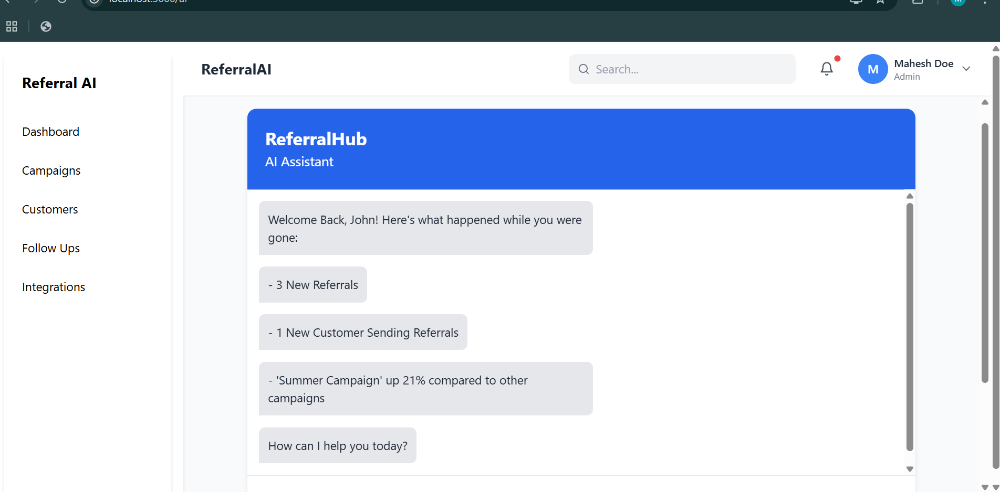
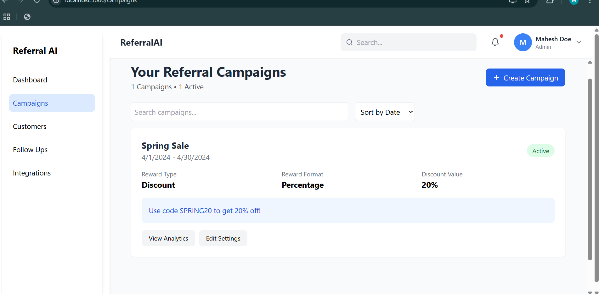
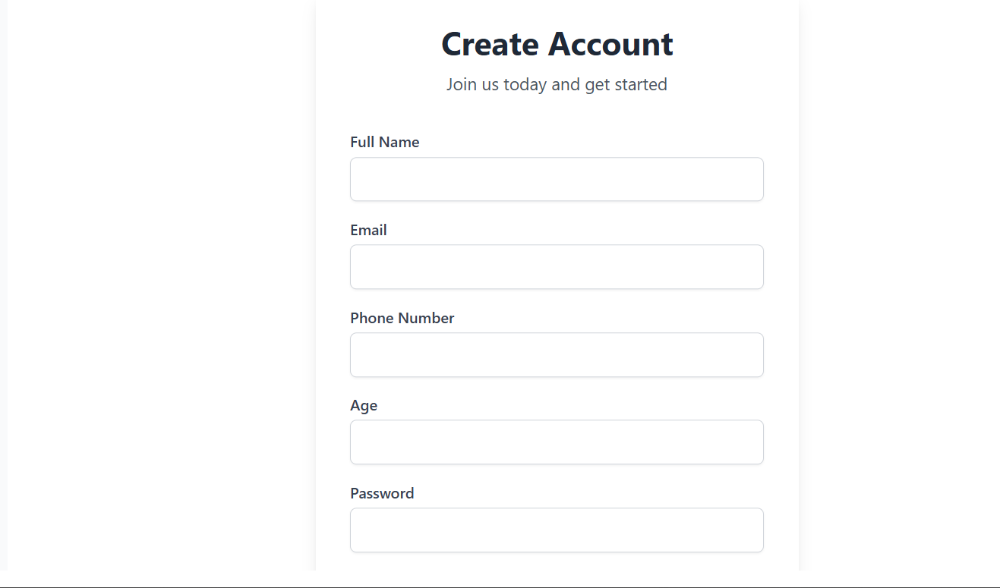
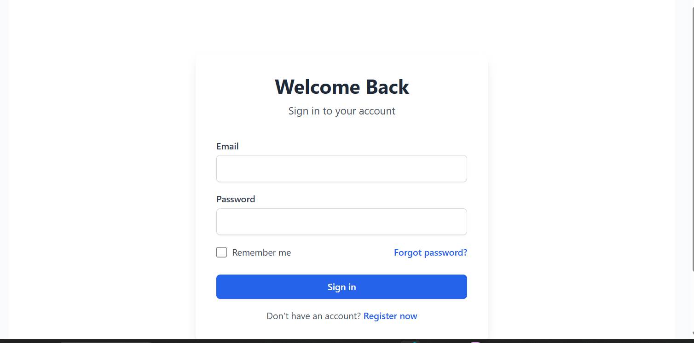
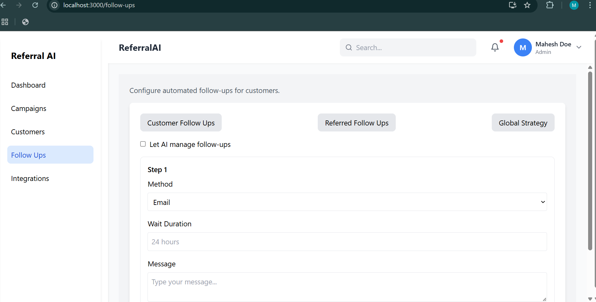
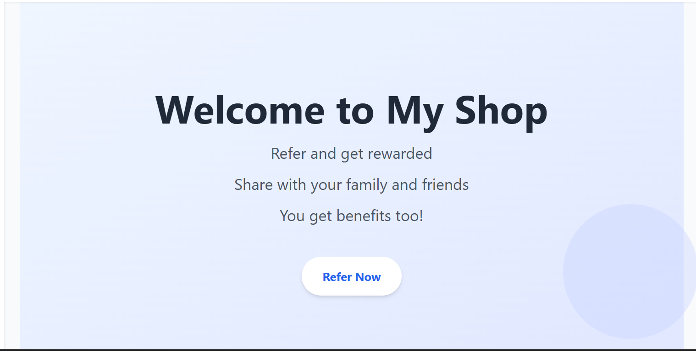
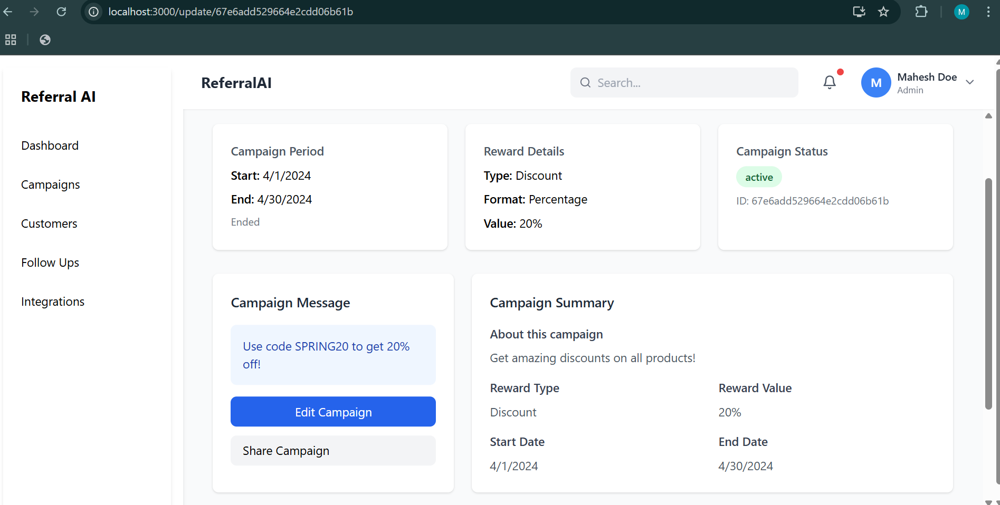

# Referral Campaign Platform


A full-stack referral campaign platform where businesses can create campaigns, share with existing customers, and reward them for referring friends and family. Referrals can be shared via WhatsApp, Email, SMS, Instagram, and Telegram.

## Features

- 🚀 Create and manage referral campaigns
- 👥 Customer referral tracking
- 💰 Reward system for successful referrals
- 📱 Multi-platform sharing (WhatsApp, Email, SMS, Instagram, Telegram)
- 📊 Analytics dashboard
- 🔐 Secure authentication system
- ✨ Beautiful UI with animations

## Technologies Used

### Frontend
- ⚛️ React.js
- 🎨 Tailwind CSS
- 🏃 Framer Motion (for animations)
- 🔄 React Router DOM
- 🖼️ React Icons

### Backend
- 🟢 Node.js
- 🚂 Express.js
- 🔐 BcryptJS (password hashing)
- 🔑 JSON Web Tokens (JWT)
- 🍃 MongoDB (database)

## Project Structure
referral-campaign/
├── client/ # Frontend code
│ ├── public/ # Static files
│ ├── src/ # React components
│ │ ├── components/ # Reusable components
│ │ ├── pages/ # Application pages
│ │ ├── App.js # Main App component
│ │ └── index.js # Entry point
│ └── package.json # Frontend dependencies
│
├── server/ # Backend code
│ ├── config/ # Configuration files
│ └── server.js # Server entry point
└── README.md # Project documentation

Copy

## Screenshots

| Page | Screenshot |
|------|------------|
|------|------------|
| AI Page |  |
| Campaign Page |  |
| Register Page |  |
| Login Page |  |
| Follow-up Page |  |
| Hero Page |  |
| Campaign Update Page |  |

## Installation

### Frontend Setup
1. Clone the frontend repository:
   ```bash
   git clone https://github.com/maheshkumar77/HumanityFoundersTask.git
   cd HumanityFoundersTask
Install dependencies:

bash
Copy
npm install
Start the development server:

bash
Copy
npm start
Backend Setup
Clone the backend repository:

bash
Copy
git clone https://github.com/maheshkumar77/TaskBackend.git
cd TaskBackend
Install dependencies:

bash
Copy
npm install
Create a .env file based on .env.example and add your credentials.

Start the server:

bash
Copy
npm start
Environment Variables
For the backend to work properly, you need to set up the following environment variables in your .env file:

Copy
MONGO_URI=your_mongodb_connection_string
JWT_SECRET=your_jwt_secret_key
PORT=5000
API Endpoints
Method	Endpoint	Description
POST	/api/auth/register	Register a new user
POST	/api/auth/login	Login existing user
GET	/api/campaigns	Get all campaigns
POST	/api/campaigns	Create new campaign
PUT	/api/campaigns/:id	Update campaign
DELETE	/api/campaigns/:id	Delete campaign
GET	/api/customers	Get all customers
POST	/api/customers	Add new customer
POST	/api/referrals	Create new referral
Deployment
The application is deployed with the following links:


Contributing
Fork the project

Create your feature branch (git checkout -b feature/AmazingFeature)

Commit your changes (git commit -m 'Add some AmazingFeature')

Push to the branch (git push origin feature/AmazingFeature)

Open a Pull Request

License
Distributed under the MIT License. See LICENSE for more information.

Contact
Mahesh Kumar -maheshkumarsahu605@gmail.com

Project Link: https://github.com/maheshkumar77/HumanityFoundersTask

Copy

### Key Sections Included:

1. **Project Overview**: Brief description of what the project does
2. **Features**: Highlighting key functionalities
3. **Tech Stack**: Clear separation of frontend and backend technologies
4. **Project Structure**: Visual representation of the code organization
5. **Screenshots**: Placeholders for your 9 images (replace placeholder URLs with actual screenshots)
6. **Installation**: Step-by-step setup instructions for both frontend and backend
7. **Environment Variables**: Important configuration details
8. **API Endpoints**: Documentation of backend routes
9. **Deployment**: Links to your deployed applications
10. **License & Contact**: Project ownership information

To complete your README:
1. Replace placeholder image URLs with actual screenshots of your application
2. Update the deployment links when you have them
3. Add your actual contact information
4. Consider adding a "Future Improvements" section if you have planned features

This README provides comprehensive documentation that will help other developers understand, run, and potentially contribute to your project.
